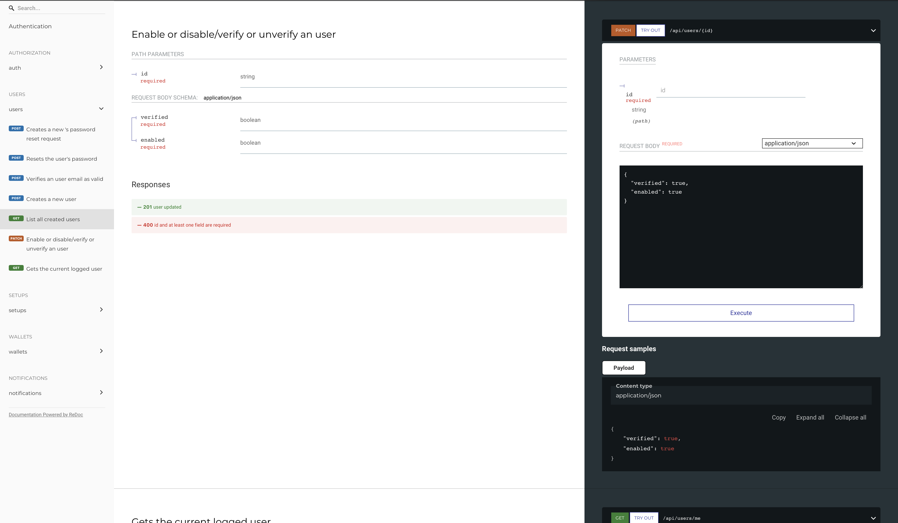

<h1 align="center">
    Redoc - Try Out
    <h4 align="center">
        The <i>Try Out</i> <a href="https://swagger.io">Swagger's</a> feature on <a href="https://github.com/Redocly/redoc">Redoc</a>
    </h4>
</h1>

<div align="center">
    <a href="http://makeapullrequest.com">
        
    </a>
    <a href="https://opensource.org/licenses/MIT">
        
    </a>
</div>
<div align="center">

[Live Demo](#Live-demo) |
[Installation](#Installation) |
[How to use](#How-to-use) |
[Available Options](#Available-options) |
[Credits](#Credits) |
[Changelog](#Changelog) |
[TODO](#TODO)

</div>



<p align="center">
    It's extends <a href="https://github.com/Redocly/redoc">Redoc</a> adding the <a href="https://swagger.io">Swagger's</a> <i>Try Out</i> feature.
</p>

## Live Demo

Online preview [Pet Store](https://cdn.jsdelivr.net/npm/redoc-try-it-out/demo.html) live demo.

## Installation

### Browser
#### Script tag
`<script type="text/javascript" src="https://cdn.jsdelivr.net/npm/redoc-try-it-out/dist/try-it-out.min.js"></script>`

## How to use

After importing the script bundle, just configure and init it.

```html
<div id="redoc_container"></div>
<script>
    RedocTryItOut.init(
        "https://petstore.swagger.io/v2/swagger.json",
        { title: "Pet Store" }, 
        document.getElementById("redoc_container")
    )
</script>
```

## Available options

### RedocTryItOut Init Options

| Option                  | Description                     | Type                                              | Note                                      |
| ----------------------- | ------------------------------- | ------------------------------------------------- | ----------------------------------------- |
| docUrl                  | URL swagger's spec file         | string                                            |                                           |
| cfg                     | Redoc try it out config options | [RedocTryItOutOptions](#Redoc-Try-It-Out-Options) | See options table                         |
| element (optional)      | Redoc wrapper container         | HTMLElement                                       | If not set, a wrapper will be created     |


### Redoc Try It Out Options

RedocTryItOutOptions extends <i>RedocOptions</i>, documented on [Redoc documentation](https://github.com/Redocly/redoc)

| Option                    | Description                                                   | Type                                              | Default                                   |
| ------------------------- | ------------------------------------------------------------- | ------------------------------------------------- | ----------------------------------------- |
| tryItOutEnabled           | Enable/Disable Try Out feature                                | boolean                                           | `false`                                   |
| tryItBoxContainerId       | Id of the element created dynamically as Try Out container    | string                                            | `'try-out-wrapper'`                       |
| containerId               | Redoc wrapper container id (used when no element is provided) | string                                            | `'redoc-container'`                       |
| operationBoxSelector      | Redoc operation box selector                                  | string                                            | `'[data-section-id]'`                     |
| selectedOperationClass    | Class name added into selected operation                      | string                                            | `'try'`                                   | 
| redocVersion              | Redoc version                                                 | string                                            | `'2.0.0-rc.56'`                           |
| authBtn                   | Auth Button Options                                           | [AuthBtnOptions](#auth-button-options)            | [See the table](#auth-button-options)     |
| tryBtn                    | Try Out Button Options                                        | [TryBtnOptions](#try-button-options)              | [See the table](#try-button-options)      |
| stylerMatcher             | Styler Matcher Options                                        | [StyleMatcherOptions](#style-matcher-options)     | [See the table](#style-matcher-options)   |
| swaggerOptions            | Swagger Options                                               | [SwaggerOptions](#swagger-options)                | [See the table](#swagger-options)         |
| dependenciesVersions      | Set of dependencies version                                   | [DependenciesVersions](#dependencies-versions)    | [See the table](#dependencies-versions)   |

### Auth Button Options

| Option        | Description                                       | Type      | Default       |
| ------------- | ------------------------------------------------- | --------- | ------------- |
| posSelector   | Selector where the button will be added after of  | string    | `'h1:eq(0)'`  |
| text          | The button text                                   | string    | `'AUTHORIZE'` |
| className     | The button class name used tracking the element   | string    | `'_auth-btn'` |

### Try Button Options

| Option            | Description                                               | Type      | Default       |
| ----------------- | --------------------------------------------------------- | --------- | ------------- |
| siblingSelector   | Selector where the button will be added as sibling of     | string    | `'.http-verb'`|
| text              | The button text                                           | string    | `'TRY OUT'`   |
| className         | The button class name used tracking the element           | string    | `'tryBtn'`    |
| selectedClassName | The button class name used tracking the selected element  | string    | `'selected'`  |

### Style Matcher Options

#### Style matcher is a utility used to clone Redoc style into Swagger, avoiding layout discrepancies

| Option                                    | Type   | Default                                                                                      | 
| ----------------------------------------- | ------ |--------------------------------------------------------------------------------------------- |
| informationContainerTargetSelector        | string | `'.swagger-ui .information-container'`                                                       | 
| schemeContainerTargetSelector             | string | `'.swagger-ui .scheme-container'`                                                            |
| modelsContainerTargetSelector             | string | `'.swagger-ui .models'`                                                                      |
| inputTargetSelector                       | string | `'.swagger-ui input[type=text]'`                                                             |
| selectTargetSelector                      | string | `'.swagger-ui .opblock select'`                                                              |
| textAreaTargetSelector                    | string | `'.swagger-ui .opblock textarea'`                                                            |
| paragraphTargetSelector                   | string | `'.swagger-ui .opblock p'`                                                                   |
| executeBtnTargetSelector                  | string | `'.swagger-ui .opblock .btn.execute'`                                                        |
| responseContainerTargetSelector           | string | `'.swagger-ui .opblock .opblock-body .responses-inner'`                                      |
| responseTitleTargetSelector               | string | `'.swagger-ui .opblock .responses-inner > div > h4'`                                         |
| responseHeaderTargetSelector              | string | `'.swagger-ui .opblock .responses-inner h4'`                                                 |
| responseTableTargetSelector               | string | `'.swagger-ui .opblock .responses-inner > .responses-table'`                                 |
| responseWrapperTargetSelector             | string | `'.swagger-ui .opblock .responses-wrapper'`                                                  |
| responseWrapperResultTargetSelector       | string | `'.swagger-ui .opblock .btn-group + .responses-wrapper'`                                     |
| responseMicrolightTargetSelector          | string | `'.swagger-ui .opblock .microlight'`                                                         |
| responseCodeTargetSelector                | string | `'.swagger-ui .opblock .microlight code'`                                                    |
| responseClipboardTargetSelector           | string | `'.swagger-ui .opblock .responses-inner .copy-to-clipboard'`                                 |
| responseClipboardBtnTargetSelector        | string | `'.swagger-ui .opblock .responses-inner .copy-to-clipboard button'`                          |
| responseCurlClipboardTargetSelector       | string | `'.swagger-ui .opblock .responses-inner .curl-command .copy-to-clipboard'`                   |
| responseDownloadTargetSelector            | string | `'.swagger-ui .opblock .responses-inner .download-contents'`                                 |
| serverResponseHeaderTargetSelector        | string | `'.swagger-ui .opblock .responses-inner .responses-header td.col_header'`                    |
| serverResponseStatusTargetSelector        | string | `'.swagger-ui .opblock .responses-inner .response .response-col_status'`                     |
| serverResponseDescriptionTargetSelector   | string | `'.swagger-ui .opblock .responses-inner .response .response-col_description'`                |
| serverResponseSubHeaderTargetSelector     | string | `'.swagger-ui .opblock .responses-inner .response h5'`                                       |
| clearBtnTargetSelector                    | string | `'.swagger-ui .opblock .btn-group .btn-clear'`                                               |
| operationTagTargetSelector                | string | `'.swagger-ui .opblock-tag[data-tag]'`                                                       |
| operationHeaderContainerTargetSelector    | string | `'.swagger-ui .opblock .opblock-section-header'`                                             |
| operationHeaderTargetSelector             | string | `'.swagger-ui .opblock .opblock-section-header h4'`                                          |
| operationHeaderDecorationTargetSelector   | string | `'.swagger-ui .opblock .opblock-section-header h4 span::after'`                              |
| operationTryOutTargetSelector             | string | `'.swagger-ui .operation-tag-content div.try-out'`                                           |
| descriptionContainerTargetSelector        | string | `'.swagger-ui .opblock .opblock-body .opblock-description-wrapper'`                          |
| summaryTargetSelector                     | string | `'.swagger-ui .operation-tag-content div.opblock .opblock-summary'`                          |
| modalHeaderContainerTargetSelector        | string | `'.swagger-ui .dialog-ux .modal-ux-header'`                                                  |
| modalHeaderTargetSelector                 | string | `'.swagger-ui .dialog-ux .modal-ux-header h3'`                                               |
| modalTitleTargetSelector                  | string | `'.swagger-ui .dialog-ux .modal-ux-content h4'`                                              |
| modalTitleCodeTargetSelector              | string | `'.swagger-ui .dialog-ux .modal-ux-content .wrapper code'`                                   |
| modalLabelTargetSelector                  | string | `'.swagger-ui .modal-ux label'`                                                              |
| modalCodeTargetSelector                   | string | `'.swagger-ui .modal-ux code'`                                                               |
| modalBtnTargetSelector                    | string | `'.swagger-ui .modal-ux button'`                                                             |
| parametersTableContainerTargetSelector    | string | `'.swagger-ui .opblock .table-container'`                                                    |
| parametersHeadTargetSelector              | string | `'.swagger-ui .opblock .table-container table.parameters thead'`                             |
| parameterNameFieldTargetSelector          | string | `'.swagger-ui .opblock .table-container table.parameters .parameter__name'`                  |
| parameterTypeFieldTargetSelector          | string | `'.swagger-ui .opblock .table-container table.parameters .parameter__type'`                  |
| parameterDeprecatedTargetSelector         | string | `'.swagger-ui .opblock .table-container table.parameters .parameter__deprecated'`            |
| parameterSourceTargetSelector             | string | `'.swagger-ui .opblock .table-container table.parameters .parameter__in'`                    |
| parameterRequiredMarkerTargetSelector     | string | `'.swagger-ui .opblock .table-container table.parameters .parameter__name.required span'`    |
| parameterRequiredTargetSelector           | string | `'.swagger-ui .opblock .table-container table.parameters .parameter__name.required::after'`  |
| apiContentSourceSelector                  | string | `'.api-content'`                                                                             |
| inputSourceSelector                       | string | `'[kind=field] ~ td'`                                                                        |
| codeSourceSelector                        | string | `'code'`                                                                                     |
| codeBoxSourceSelector                     | string | `'[data-section-id] [role=tabpanel]'`                                                        |
| dataSectionSourceSelector                 | string | `'[data-section-id] > div > div'`                                                            |
| fieldSourceSelector                       | string | `'[kind=field]'`                                                                             |
| requiredFieldSourceSelector               | string | `'[kind=field] div'`                                                                         |
| fieldMarkerSourceSelector                 | string | `'[kind=field]:first span:first-child'`                                                      |
| sanSerifFontSourceSelector                | string | `'h2'`                                                                                       |
| alternativeMonospaceFontSourceSelector    | string | `'[kind=field] span'`                                                                        |
| alternativeSansSerifSourceSelector        | string | `'h5'`                                                                                       |
| h2SourceSelector                          | string | `'h2'`                                                                                       |
| h3SourceSelector                          | string | `'h3'`                                                                                       |
| h5SourceSelector                          | string | `'h5'`                                                                                       |
| labelSourceSelector                       | string | `'[kind=field] ~ td'`                                                                        |
| typeSourceSelector                        | string | `'[kind=field] ~ td span'`                                                                   |
| btnSourceSelector                         | string | `'[role=tabpanel] button'`                                                                   |
| defaultBorderColorSelector                | string | `'h5'`                                                                                       |
| authBtnSourceSelector                     | string | `'a[href*="swagger.json"]:eq(0)'`                                                            |
| httpVerbSourceSelector                    | string | `'[data-section-id] .http-verb'`                                                             |


### Swagger Options

| Option                            | Description                                               | Type      | Default                                                                   |
| --------------------------------- | --------------------------------------------------------- | --------- | ------------------------------------------------------------------------- |
| url                               | URL swagger's spec file                                   | string    | `RedocTryItOut.docUrl`                                                    |
| dom_id                            | Swagger wrapper container id                              | string    | `'#swagger-ui'`                                                           |
| authorizeBtnSelector              | The authorize button selector                             | string    | `'.swagger-ui .auth-wrapper .authorize'`                                  |
| authorizeModalSelector            | The authorize modal selector                              | string    | `'.swagger-ui .dialog-ux .modal-ux'`                                      |
| authorizeDoneBtnSelector          | The authorize modal done button selector                  | string    | `'.swagger-ui .auth-btn-wrapper .btn-done'`                               |
| authorizeModalCloseBtnSelector    | The authorize modal close button selector                 | string    | `'.swagger-ui .dialog-ux .modal-ux-header .close-modal'`                  |
| operationContainerSelector        | The operation container selector                          | string    | `'.swagger-ui .opblock'`                                                  |
| operationSectionContainerSelector | The operation section container selector                  | string    | `'.swagger-ui .opblock-tag-section'`                                      |
| operationSummaryPatternSelector   | The operation summary pattern selector                    | string    | `'.swagger-ui .opblock .opblock-summary-{method} [data-path="{api}"]'`    |
| wrapperSelector                   | The wrapper selector                                      | string    | `'.swagger-ui .wrapper'`                                                  |
| hideClass                         | The hide class name added to hide swagger                 | string    | `'hide'`                                                                  |
| showClass                         | The show class name added to show swagger                 | string    | `'show'`                                                                  |
| authModalClass                    | The modal class name added to show auth modal             | string    | `'auth-modal'`                                                            |
| selectedOperationContainerClass   | The class name added mark an operation box as selected    | string    | `'opened-shadow'`                                                         |
| onComplete                        | The function called when swagger load is completed        | Function  | `CallbackFunction`                                                        |
| version                           | The swagger version                                       | string    | `'3.48.0'`                                                                |

### Dependencies Versions

| Option            | Description               | Type      | Default   |
| ----------------- | ------------------------- | --------- | --------- |
| jquery            | JQuery version            | string    | `'3.6.0'` |
| jqueryScrollTo    | JQuery ScrollTo version   | string    | `'2.1.2'` |


## Credits

It's based on [wll8.github.io/redoc-try](https://github.com/wll8/redoc-try) work.

## Changelog

Bellow are a list of changes, some might go undocumented

- 1.0.0 - First release
- 1.0.1 - Remove png from package
- 1.0.2 - Fix main file
- 1.0.3 - Add live demo and fix README

## TODO

- Finish up the documentation
- Add Unittests
